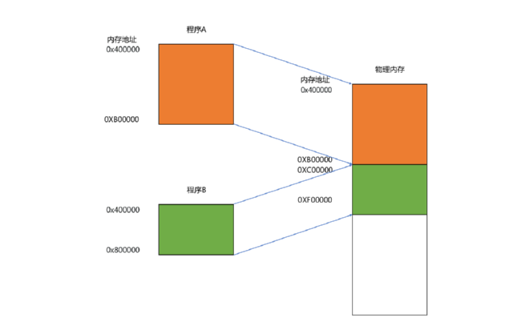
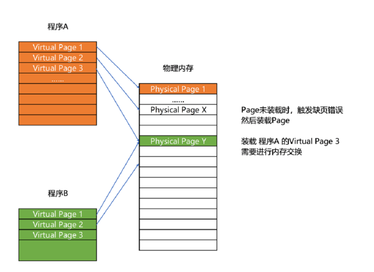

# 09 | 程序装载：“640K内存”真的不够用么？

计算机这个行业的历史上有过很多成功的预言，最著名的自然是“摩尔定律”。当然免不了的也有很多“失败”的预测，其中一个最著名的就是，比尔·盖茨在上世纪 80 年代说的“640K ought to be enough for anyone”，也就是“640K 内存对哪个人来说都够用了”。

那个年代，微软开发的还是 DOS 操作系统，程序员们还在绞尽脑汁，想要用好这极为有限的 640K 内存。而现在，我手头的开发机已经是 16G 内存了，上升了一万倍还不止。那比尔·盖茨这句话在当时也是完全的无稽之谈么？有没有哪怕一点点的道理呢？这一讲里，我就和你一起来看一看。

## **程序装载面临的挑战**

上一讲，我们看到了如何通过链接器，把多个文件合并成一个最终可执行文件。在运行这些可执行文件的时候，我们其实是通过一个装载器，解析 ELF 或者 PE 格式的可执行文件。装载器会把对应的指令和数据加载到内存里面来，让 CPU 去执行。

说起来只是装载到内存里面这一句话的事儿，实际上装载器需要满足两个要求。

**第一，可执行程序加载后占用的内存空间应该是连续的**。我们在[第 6 讲](https://time.geekbang.org/column/article/94075)讲过，执行指令的时候，程序计数器是顺序地一条一条指令执行下去。这也就意味着，这一条条指令需要连续地存储在一起。

**第二，我们需要同时加载很多个程序，并且不能让程序自己规定在内存中加载的位置。**虽然编译出来的指令里已经有了对应的各种各样的内存地址，但是实际加载的时候，我们其实没有办法确保，这个程序一定加载在哪一段内存地址上。因为我们现在的计算机通常会同时运行很多个程序，可能你想要的内存地址已经被其他加载了的程序占用了。

要满足这两个基本的要求，我们很容易想到一个办法。那就是我们可以在内存里面，找到一段连续的内存空间，然后分配给装载的程序，然后把这段连续的内存空间地址，和整个程序指令里指定的内存地址做一个映射。

我们把指令里用到的内存地址叫作**虚拟内存地址**（Virtual Memory Address），实际在内存硬件里面的空间地址，我们叫**物理内存地址**（Physical Memory Address）**。**

程序里有指令和各种内存地址，我们只需要关心虚拟内存地址就行了。对于任何一个程序来说，它看到的都是同样的内存地址。我们维护一个虚拟内存到物理内存的映射表，这样实际程序指令执行的时候，会通过虚拟内存地址，找到对应的物理内存地址，然后执行。因为是连续的内存地址空间，所以我们只需要维护映射关系的起始地址和对应的空间大小就可以了。

## **内存分段**

这种找出一段连续的物理内存和虚拟内存地址进行映射的方法，我们叫**分段**（Segmentation）**。**这里的段，就是指系统分配出来的那个连续的内存空间。



分段的办法很好，解决了程序本身不需要关心具体的物理内存地址的问题，但它也有一些不足之处，第一个就是**内存碎片**（Memory Fragmentation）的问题。

我们来看这样一个例子。我现在手头的这台电脑，有 1GB 的内存。我们先启动一个图形渲染程序，占用了 512MB 的内存，接着启动一个 Chrome 浏览器，占用了 128MB 内存，再启动一个 Python 程序，占用了 256MB 内存。这个时候，我们关掉 Chrome，于是空闲内存还有 1024 - 512 - 256 = 256MB。按理来说，我们有足够的空间再去装载一个 200MB 的程序。但是，这 256MB 的内存空间不是连续的，而是被分成了两段 128MB 的内存。因此，实际情况是，我们的程序没办法加载进来。


当然，这个我们也有办法解决。解决的办法叫**内存交换**（Memory Swapping）。

我们可以把 Python 程序占用的那 256MB 内存写到硬盘上，然后再从硬盘上读回来到内存里面。不过读回来的时候，我们不再把它加载到原来的位置，而是紧紧跟在那已经被占用了的 512MB 内存后面。这样，我们就有了连续的 256MB 内存空间，就可以去加载一个新的 200MB 的程序。如果你自己安装过 Linux 操作系统，你应该遇到过分配一个 swap 硬盘分区的问题。这块分出来的磁盘空间，其实就是专门给 Linux 操作系统进行内存交换用的。

虚拟内存、分段，再加上内存交换，看起来似乎已经解决了计算机同时装载运行很多个程序的问题。不过，你千万不要大意，这三者的组合仍然会遇到一个性能瓶颈。硬盘的访问速度要比内存慢很多，而每一次内存交换，我们都需要把一大段连续的内存数据写到硬盘上。所以，如果内存交换的时候，交换的是一个很占内存空间的程序，这样整个机器都会显得卡顿。

## **内存分页**

既然问题出在内存碎片和内存交换的空间太大上，那么解决问题的办法就是，少出现一些内存碎片。另外，当需要进行内存交换的时候，让需要交换写入或者从磁盘装载的数据更少一点，这样就可以解决这个问题。这个办法，在现在计算机的内存管理里面，就叫作**内存分页**（Paging）。

**和分段这样分配一整段连续的空间给到程序相比，分页是把整个物理内存空间切成一段段固定尺寸的大小**。而对应的程序所需要占用的虚拟内存空间，也会同样切成一段段固定尺寸的大小。这样一个连续并且尺寸固定的内存空间，我们叫**页**（Page）。从虚拟内存到物理内存的映射，不再是拿整段连续的内存的物理地址，而是按照一个一个页来的。页的尺寸一般远远小于整个程序的大小。在 Linux 下，我们通常只设置成 4KB。你可以通过命令看看你手头的 Linux 系统设置的页的大小。

```
getconf PAGE_SIZE

```

由于内存空间都是预先划分好的，也就没有了不能使用的碎片，而只有被释放出来的很多 4KB 的页。即使内存空间不够，需要让现有的、正在运行的其他程序，通过内存交换释放出一些内存的页出来，一次性写入磁盘的也只有少数的一个页或者几个页，不会花太多时间，让整个机器被内存交换的过程给卡住。



更进一步地，分页的方式使得我们在加载程序的时候，不再需要一次性都把程序加载到物理内存中。我们完全可以在进行虚拟内存和物理内存的页之间的映射之后，并不真的把页加载到物理内存里，而是只在程序运行中，需要用到对应虚拟内存页里面的指令和数据时，再加载到物理内存里面去。

实际上，我们的操作系统，的确是这么做的。当要读取特定的页，却发现数据并没有加载到物理内存里的时候，就会触发一个来自于 CPU 的**缺页错误**（Page Fault）。我们的操作系统会捕捉到这个错误，然后将对应的页，从存放在硬盘上的虚拟内存里读取出来，加载到物理内存里。这种方式，使得我们可以运行那些远大于我们实际物理内存的程序。同时，这样一来，任何程序都不需要一次性加载完所有指令和数据，只需要加载当前需要用到就行了。

通过虚拟内存、内存交换和内存分页这三个技术的组合，我们最终得到了一个让程序不需要考虑实际的物理内存地址、大小和当前分配空间的解决方案。这些技术和方法，对于我们程序的编写、编译和链接过程都是透明的。这也是我们在计算机的软硬件开发中常用的一种方法，就是**加入一个间接层**。

通过引入虚拟内存、页映射和内存交换，我们的程序本身，就不再需要考虑对应的真实的内存地址、程序加载、内存管理等问题了。任何一个程序，都只需要把内存当成是一块完整而连续的空间来直接使用。

## **总结延伸**

现在回到开头我问你的问题，我们的电脑只要 640K 内存就够了吗？很显然，现在来看，比尔·盖茨的这个判断是不合理的，那为什么他会这么认为呢？因为他也是一个很优秀的程序员啊！

在虚拟内存、内存交换和内存分页这三者结合之下，你会发现，其实要运行一个程序，“必需”的内存是很少的。CPU 只需要执行当前的指令，极限情况下，内存也只需要加载一页就好了。再大的程序，也可以分成一页。每次，只在需要用到对应的数据和指令的时候，从硬盘上交换到内存里面来就好了。以我们现在 4K 内存一页的大小，640K 内存也能放下足足 160 页呢，也无怪乎在比尔·盖茨会说出“640K ought to be enough for anyone”这样的话。

不过呢，硬盘的访问速度比内存慢很多，所以我们现在的计算机，没有个几 G 的内存都不好意思和人打招呼。

那么，除了程序分页装载这种方式之外，我们还有其他优化内存使用的方式么？下一讲，我们就一起来看看“动态装载”，学习一下让两个不同的应用程序，共用一个共享程序库的办法。

## **推荐阅读**

想要更深入地了解代码装载的详细过程，推荐你阅读《程序员的自我修养——链接、装载和库》的第 1 章和第 6 章。

## **课后思考**

请你想一想，在 Java 这样使用虚拟机的编程语言里面，我们写的程序是怎么装载到内存里面来的呢？它也和我们讲的一样，是通过内存分页和内存交换的方式加载到内存里面来的么？