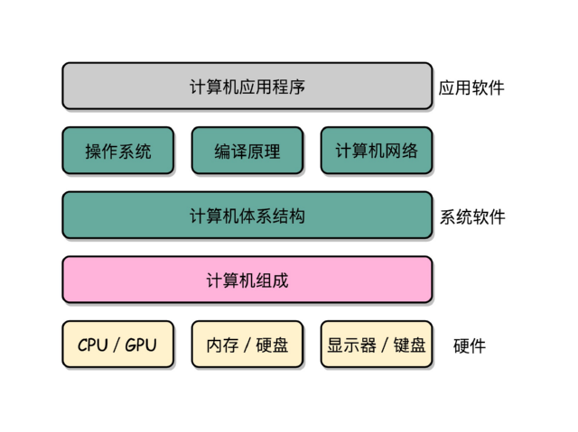

# **开篇词 | 为什么你需要学习计算机组成原理？**

你好，我是徐文浩，一个正在创业的工程师。目前主要是通过自然语言处理技术，为走向海外的中国企业提供英语的智能客服和社交网络营销服务。

2005 年从上海交通大学计算机系毕业之后，我一直以写代码为生。如果从 7 岁第一次在少年宫写程序开始算起，到今天，我的码龄快有 30 岁了。这些年里，我在 Trilogy Software 写过各种大型企业软件；在 MediaV 这样的广告科技公司，从零开始搭建过支撑每天百亿流量的广告算法系统；2015 年，我又加入了拼多多，参与重写拼多多的交易系统。

这么多年一直在开发软件，我深感软件这个行业变化太快了。语言上，十年前流行 Java，这两年流行 Go；框架上，前两年流行 TensorFlow，最近又流行 PyTorch。我逐渐发现，学习应用层的各种语言、框架，好比在练拳法招式，可以短期给予你回报，而深入学习“底层知识”，就是在练扎马步、核心肌肉力量，是在提升你自己的“根骨”和“资质”。

正所谓“练拳不练功，到老一场空”。**如果越早去弄清楚计算机的底层原理，在你的知识体系中“储蓄”起这些知识，也就意味着你有越长的时间来收获学习知识的“利息”。虽然一开始可能不起眼，但是随着时间带来的复利效应，你的长线投资项目，就能让你在成长的过程中越走越快。**

## **计算机底层知识的“第一课”**

如果找出各大学计算机系的培养计划，你会发现，它们都有差不多十来门核心课程。其中，“计算机组成原理”是入门和底层层面的第一课。

这是为什么呢？我们直接用肉眼来看，计算机是由 CPU、内存、显示器这些设备组成的硬件，但是，计算机系的学生毕业之后，大部分却都是从事各种软件开发工作。显然，在硬件和软件之间需要一座桥梁，而“计算机组成原理”就扮演了这样一个角色，它既隔离了软件和硬件，也提供了让软件无需关心硬件，就能直接操作硬件的接口。

也就是说，你只需要对硬件有原理性的理解，就可以信赖硬件的可靠性，安安心心用高级语言来写程序。无论是写操作系统和编译器这样的硬核代码，还是写 Web 应用和手机 App 这样的应用层代码，你都可以做到心里有底。

除此之外，组成原理是计算机其他核心课程的一个“导引”。学习组成原理之后，向下，你可以学习数字电路相关的课程，向上，你可以学习编译原理、操作系统这些核心课程。如果想要深入理解，甚至设计一台自己的计算机，体系结构是必不可少的一门课，而组成原理是计算机体系结构的一个入门版本。

所以说，无论你想要学习计算机的哪一门核心课程，之前你都应该先学习一下“计算机组成原理”，这样无论是对计算机的硬件原理，还是软件架构，你对计算机方方面面的知识都会有一个全局的了解。

学习这门“第一课”的过程，会为你在整个软件开发领域中打开一扇扇窗和门，让你看到更加广阔的天地。比如说，明白了高级语言是如何对应着 CPU 能够处理的一条条指令，能为你打开编译原理这扇门；搞清楚程序是如何加载运行的，能够让你对操作系统有更深入的理解。

因此，学好计算机组成原理，会让你对整个软件开发领域的全貌有一个系统了解，也会给你带来更多的职业发展机会。像我自己的团队里，有个小伙伴开始是做算法应用开发的，因为有扎实的计算机基础知识，后来就转去开发 TVM 这样的深度学习编译器了，是不是很厉害？

## **理论和实践相结合**

说了这么多计算机组成原理的重要性，但到底该怎么学呢？接下来跟你分享我的心得。

我自己对计算机硬件的发展历史一直很感兴趣，所以，我读了市面上很多组成原理相关的资料。

互联网时代，我们从来不缺少资料。无论是 Coursera 上北京大学的《计算机组成》开放课程，还是图灵奖作者写的《计算机组成与设计：硬件 / 软件接口》，都珠玉在前，是非常优秀的学习资料。不过“买书如山倒，读书如抽丝”。从业这么多年，周围想要好好学一学组成原理的工程师不少，但是真的坚持下来学完、学好的却不多。大部分买来的书，都是前面 100 页已经发黄了，后面 500 页从来没有打开过；更有不少非科班出身的程序员，直接说“这些书根本看不懂”。

对这些问题，我都深有感触。从自己学习和工作的经验看，我找到了三个主要原因。

第一，广。组成原理中的概念非常多，每个概念的信息量也非常大。比如想要理解 CPU 中的算术逻辑单元（也就是 ALU）是怎么实现加法的，需要牵涉到如何把整数表示成二进制，还需要了解这些表示背后的电路、逻辑门、CPU 时钟、触发器等知识。

第二，深。组成原理中的很多概念，阐述开来就是计算机学科的另外一门核心课程。比如，计算机的指令是怎么从你写的 C、Java 这样的高级语言，变成计算机可以执行的机器码的？如果我们展开并深入讲解这个问题，就会变成《编译原理》这样一门核心课程。

第三，学不能致用。学东西是要拿来用的，但因为这门课本身的属性，很多人在学习时，常常沉溺于概念和理论中，无法和自己日常的开发工作联系起来，以此来解决工作中遇到的问题，所以，学习往往没有成就感，就很难有动力坚持下去。

考虑到这些，在这个专栏构思之初，我就给自己定了一个交付目标：**我要把这些知识点和日常工作、生活以及整个计算机行业的发展史联系起来，教你真正看懂、学会、记住组成原理的核心内容，教你更多地从“为什么”这个角度，去理解这些知识点，而不是只是去记忆“是什么”。**

对于这个专栏，具体我是这样设计的。

第一，我把组成原理里面的知识点，和我在应用开发和架构设计中遇到的实际案例，放到一起进行印证，通过代码和案例，让你消化理解。

比如，为什么 Disruptor 这个高性能队列框架里，要定义很多没有用的占位变量呢？其实这是为了确保我们唯一关心的参数，能够始终保留在 CPU 的高速缓存里面，而高速缓存比我们的内存要快百倍以上。

第二，我会尽可能地多举一些我们日常生活里面的例子，让你理解计算机的各个组件是怎么运作的。在真实的开发中，我们会遇到什么问题，这些问题产生的根源是什么。让你从知识到应用，最终又回到知识，让学习和实践之间形成一道闭环。

计算机组成中很多组件的设计，都不是凭空发明出来，它们中的很多都来自现实生活中的想法和比喻。而底层很多硬件设计和开发的思路，其实也和你进行软件架构的开发设计和思路是一样的。

比如说，在硬件上，我们是通过最基本的与、或、非、异或门这些最基础的门电路组合形成了强大的 CPU。而在面向对象和设计模式里，我们也常常是通过定义基本的 Command，然后组合来完成更复杂的功能；再比如说，CPU 里面的冒险和分支预测的策略，就好像在接力赛跑里面后面几棒的选手早点起跑，如果交接棒没有问题，自然占了便宜，但是如果没能交接上，就会吃个大亏。

第三，在知识点和应用之外，我会多讲一些计算机硬件发展史上的成功和失败，让你明白很多设计的历史渊源，让你更容易记住“为什么”，更容易记住这些知识点。

比如说，奔腾 4 的失败，就是受限于超长流水线带来的散热和功耗问题，而移动时代 ARM 的崛起，则是因为 Intel 的芯片功耗太大，不足以在小小的手机里放下足够支撑 1 天的电池。计算机芯片的兴盛和衰亡，往往都是因为我们的计算机遇到了“功耗墙”这个散热和能耗上的挑战。而现代的云计算数据中心的设计到选址，也是围绕功耗和散热的。理解了这些成功和失败背后的原因，你自然记住了这些背后的知识点。

最后，在这三种帮助你理解“为什么”的方法之上，我会把整个的计算机组成原理通过指令、计算、CPU、存储系统和 I/O 串起来。通过一个程序的执行过程进行逐层分解，让你能对整个系统有一个全貌的了解。

我希望这个专栏，不仅能够让你学好计算机组成原理的知识，更能够成为引领你进入更多底层知识的大门，让你有动力、有方法、更深入地去进一步学习体系结构、操作系统、编译原理这样的课程，成为真正的“内家高手”。

“人生如逆旅，我亦是行人”。学习总不会是一件太轻松的事情，希望在这个专栏里，你能和我多交流，坚持练完这一手内功。