# **特别加餐 | 我在2019年F8大会的两日见闻录**

你好，我是徐文浩。4 月 30 日，我在美国圣何塞参加了 F8 大会，趁此机会和你分享一下，我在大会上的一些见闻。下面是我参会这两天写的见闻录，分享给你。希望可以看到更多技术人走出去，抬头看看世界，丰富自己的见识和经历。

## **Day 1：“The Future is Private”**

今年是我连续第三年来 F8 了。如果说第一年是带着一点好奇和忐忑，作为一个开发者来看看世界上最大的社交网络的开发者大会是怎么回事儿，到了第二年，作为一个 Developer Partner，看到自己公司的 logo 出现在首日的 Keynote 里，就觉得格外兴奋；那么今年第三年就有些轻车熟路了，没有什么压力，反而很想看一看，每年一次的开发者大会，还能办出什么新花样。

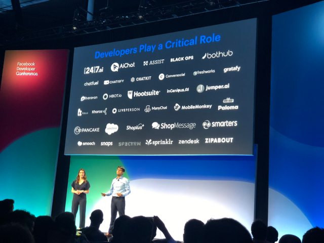

> 作为开发者，连续两年看到自己公司的 logo 出现在会场里还是很高兴的

从旧金山国际机场出来，一路 Uber 到了圣何塞住下，不禁感慨，互联网和智能手机的确改变了世界。一个中国人到美国，拿着手机也能在这里生存下来了。

为了倒时差，我硬是熬到半夜睡了一觉。早早赶到圣何塞市中心的会场，发现已经有不少人在排队入场了。

去年的 F8，因为 Facebook 面临“剑桥门事件”，主题的 Keynote 颇有些疲于应对的感觉。然而在过去的一年里，Facebook 推出的种种隐私保护的功能，似乎并没有解决“隐私泄露”的问题，反而给人一种此起彼伏、应接不暇的感觉。

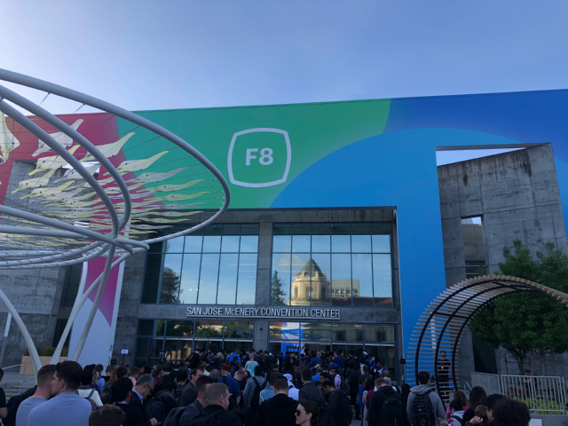

于是，今年的 F8，Facebook 颇有些破釜沉舟、不破不立之感。扎克伯格的开场 Keynote，就表示，Facebook 要开始在整个公司的运营策略上做出重大改变，打造一个“Privacy Focused Social Platform”，接着更是亮出了“The Future is Private”的 slogan。

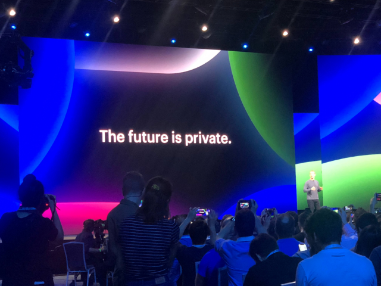

紧接着，扎克伯格介绍了 Facebook 这两年力推的产品 Messenger。Messenger 团队重写了整个手机客户端，让整个客户端小于 30MB，冷启动时间少于 1.3 秒，默认端到端加密，并给它起了一个代号叫 LightSpeed。

这几项指标都可以直接拿来，和自家被认为简单易用的 WhatsApp 做对比，而且明显胜出。为了服务更多 Messenger 的发达国家用户，Facebook 更是干脆开发了一个桌面版的客户端。要知道，在这个移动端主宰一切的年代，还会投入精力开发桌面客户端的公司可不多了。可以看出，Facebook 推动 Messenger 产品的决心。

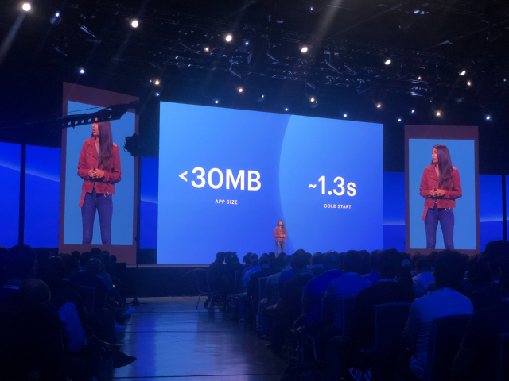

WhatsApp 产品更新介绍的核心也还是在隐私上。他们能够通过 Messenger 直接和 WhatsApp 联系人通信，这更是可以看出，Facebook 迈出了打通旗下所有产品的第一步。

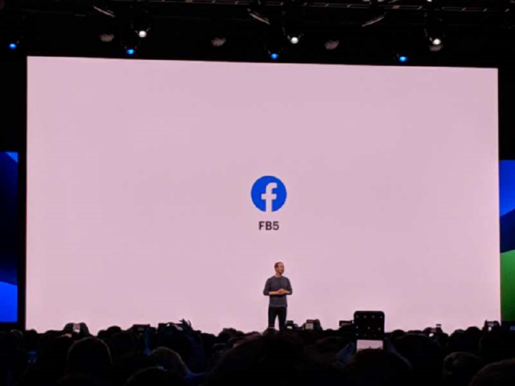

然而更重磅的还在后面。在介绍完 Messenger 和 WhatsApp 的产品更新之后，会场的大屏幕上打出了白底蓝字的“FB5”的 logo。

**作为 Facebook 最核心的产品，也是自己公司名字的 Facebook，迎来了多年以来的第一次大型改版**：App 和 Web 端界面完全重写，产品中心从原先的信息流转向以 Group 为核心。“Groups at the heart”，传统蓝底白字的“f”字 logo，也变成了有背景动图的“f”字 logo 了。

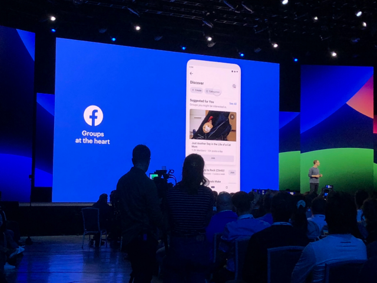

如果说其他 App 上的改动，还可以认为是 Facebook 的尝试或者探索，作为其主要收入来源的 Facebook 改版，恐怕是动真格的了。**从一个开放信息流式的产品，变成一个以 Group 为核心的、有着私密性的产品，怕是多年以来 Facebook 这个 App 的另一次重大转变了。**

之后的 Instagram、Portal 以及 Spark VR 的产品更新，都没有引起太多关注。Keynote 的下一个爆点自然是 Oculus。

Facebook 是目前市场上唯一还在大力投入 VR 的大型厂商。这一次让人尖叫的就是 Oculus Quest。这第一个“无线”的 Oculus 的确引人注目。当现场宣布所有参加 F8 的人将人手派发一个 Oculus Quest，更是引来全场的掌声。大屏幕上，看着卡马克头戴 Oculus 挥舞光剑，更是让老程序员们回忆起，在 DOS 上玩“Wolfenstein 3D”的旧时光。

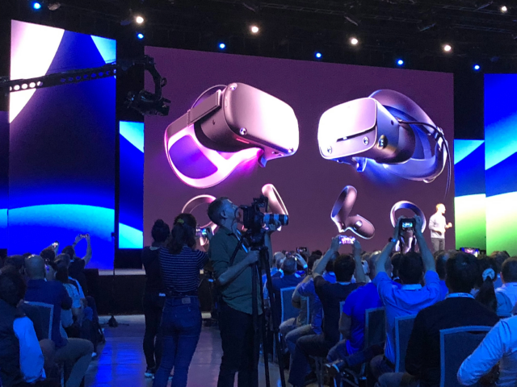

早上的 Keynote 结束之后，就是自由活动了。参会的工程师们可以选择去不同的会议室，听各种开发和产品相关的小讲座，也可以直接在主会场的各个“摊位”前，和 Facebook 的工程师沟通交流。通常如果提问的话，还会拿到背包、T 恤、帽子这样的小奖品。

当然，排长队去体验 Oculus 是每年最热门的项目。你也可以在会场里面转悠，和其他开发者认识一下。免费的零食和饮料到处都是。**与其说这是一个开发者大会，其实更像是一个 Facebook 生态圈的嘉年华。**

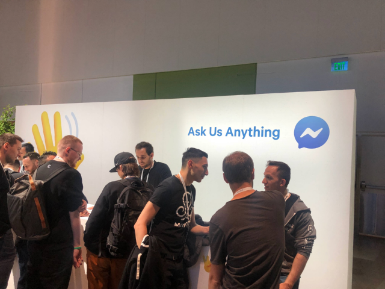

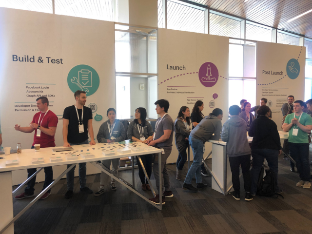

F8 的第一天，仍然是以 Facebook 自己的四大产品为核心的一个主题会议，并没有介绍太多 AI 和 VR 的黑科技。按照惯例，这些黑科技会在明天的 Keynote 呈现，值得期待。我印象比较深的是，今天在讲解 Oculus Rift S 的时候，介绍了 Oculus Insight Position Tracking，不知道明天又会有什么新科技出现。

## **Day 2：科技改变世界**

第二天的 Keynote 仍然是在圣何塞市中心的 McEnery 会议中心举办。虽然 Keynote 要到 10 点开始，但是我住的公寓没有早餐，我和同事们还是 8 点刚过就跑到会场去“蹭饭”吃。

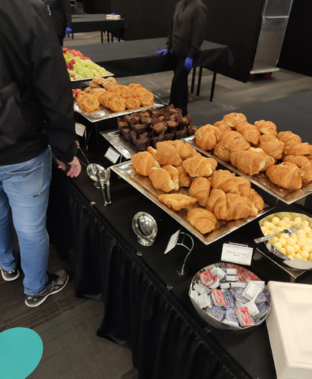

女性在科技界始终是“少数派”，所以 Facebook 特地在 F8 的第二天，在会场旁边的万豪酒店，举办了一个 Women Breakfast 的活动，邀请所有参与 F8 的女性，一起吃早餐，相互交流。

我们的一位产品经理也早早地去了会场参与这个活动。我想起，前一天的 Keynote 里，介绍 4 个核心产品的演讲者中，有 3 位都是女性，这让这个充满“科技感”的活动平添了一分人文的色彩。

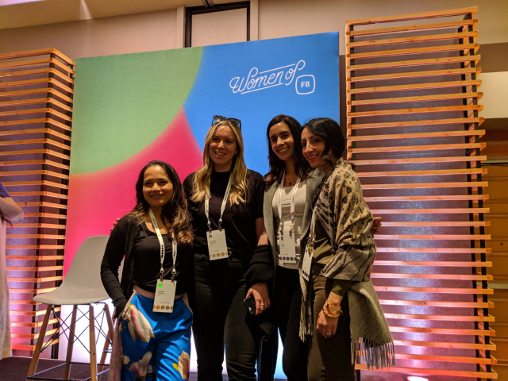

免费早餐之后，大家的焦点又转移到了主会场。第二天的主题 Keynote，不同于第一天以 Facebook 的产品为核心，而是集中在“技术”这个词上。

一般来说，第一天的 Keynote 关注的是最近这三五年来，Facebook 的产品发展方向，那么第二天的 Keynote 的目标则放得更加长远，关注的是 Facebook 未来十年会关注和投入的技术。今年也毫不例外。Connectivity、机器学习、AR 和 VR，把整个会场带入了一个更有科技感的主题里去。

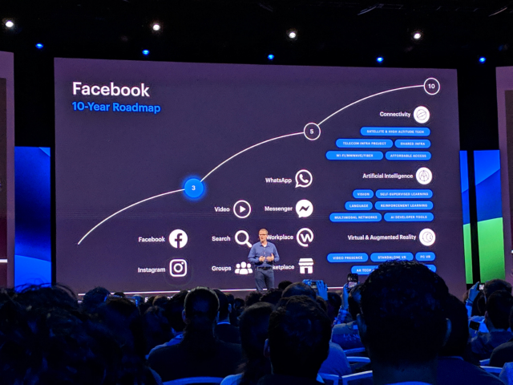

不过，今年的 Keynote 和往年的还是有点不一样。过去几年里，F8 第二天的 Keynote 都显得更有“梦想”一些，比如通过无人机为经济不发达区域提供网络接入，研究怎么通过 Reinforcement Learning 让机器打《星际争霸》。

过去两年里，我们常常能看到一些或许挑战很大，但是却又容易让人憧憬的项目出现。而今年第二天的 Keynote 主题却和前一天环环相扣，专注在了“Responsible Innovation”这样一个主题上。

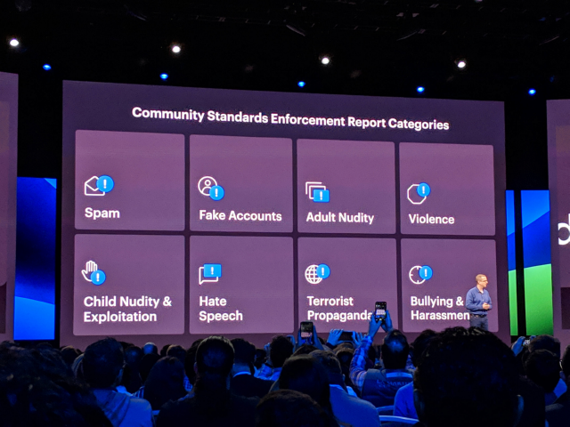

如何通过机器学习找出虚假账号，如何过滤仇恨言论，乃至如何解决网络霸凌，变成了一个个的机器学习案例，反复出现在今天的 Keynote 里。似乎 Facebook 是想更坚定地传达这样一个信息，“The Future is Private”，这件事情我们是认真的。

在整个 Keynote 的过程里面，也让大家看到了对于有害内容的过滤，从简单的关键词匹配进化到应用计算机视觉，直到今天使用的 Nearest Neighbor Manifold Expansion & Multi-modal Understanding 这样更加复杂的机器学习技术，一步一步是如何发展的。

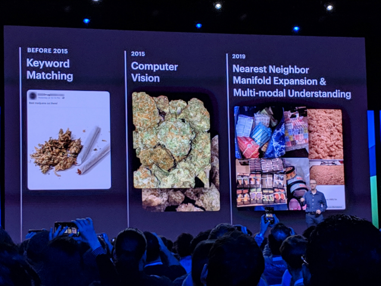

Keynote 结束之后，第二天的其他内容都安排得更加紧凑了一些。大部分的小会场都在午餐时间同时进行，内容也更加“硬核”。各个小会场里看到的不是产品更新，而是各种机器学习问题在 Facebook 的实际解决方法和应用。更有不少小会场里面，Facebook 的工程师直接给大家展示了代码。有心想要了解一些特定问题的工程师，可以从这里面学到不少有用的东西。

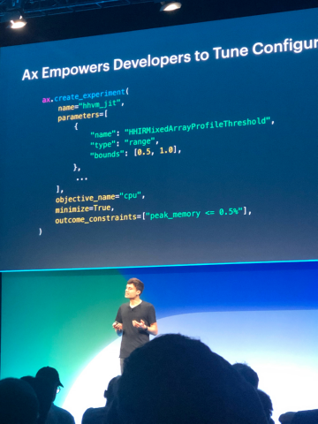

除了“学习”之外，参加 F8 很重要的一个方面是社交。第二天的有些小会场是以座谈会的形式，邀请外部的开发者合作伙伴，来分享他们的成功案例。开发者之间的相互交流也更多了起来。

在所有内容结束之后，Facebook 新加坡办公室的 Partner Manager，带着我们移师会议中心附近的餐馆，开始了一个小小的 After Party。我们一群来自五湖四海的华人，就在美国一边吃着墨西哥菜一边交流。“微信”是 Facebook 的开发者大会上始终绕不开的话题，Facebook 自己的各类消息类产品，其实也一直在从微信里面汲取养分。

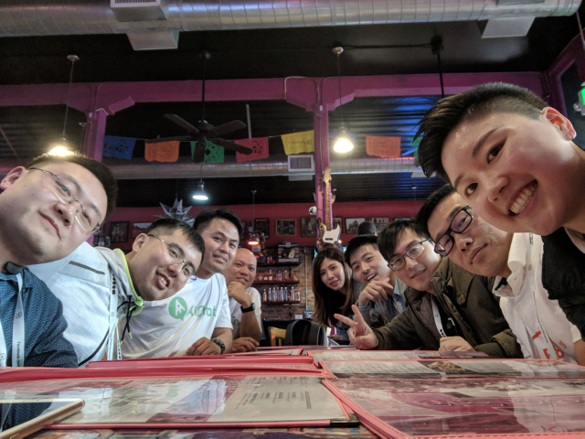

晚餐过后，今年的 F8 就算正式结束了。认识的新朋友，重新见面的老朋友，之后就又要各奔东西了。而我自己，打算在回程之前，跑一趟心心念念的计算机历史博物馆，去看看里面收藏的从 ENIAC 到现代计算机的经典型号，为今年的旅程画上一个完满的句号。

## **推荐阅读**

[Facebook：全球最大社交网络，向未知转型](https://mp.weixin.qq.com/s/UMnm2U1qKEI4V5IQdXINTQ)

[F8 2019 Day 1 Keynote](https://developers.facebook.com/videos/f8-2019/day-1-keynote/)

[F8 2019 Day 2 Keynote](https://developers.facebook.com/videos/f8-2019/day-2-keynote/)

