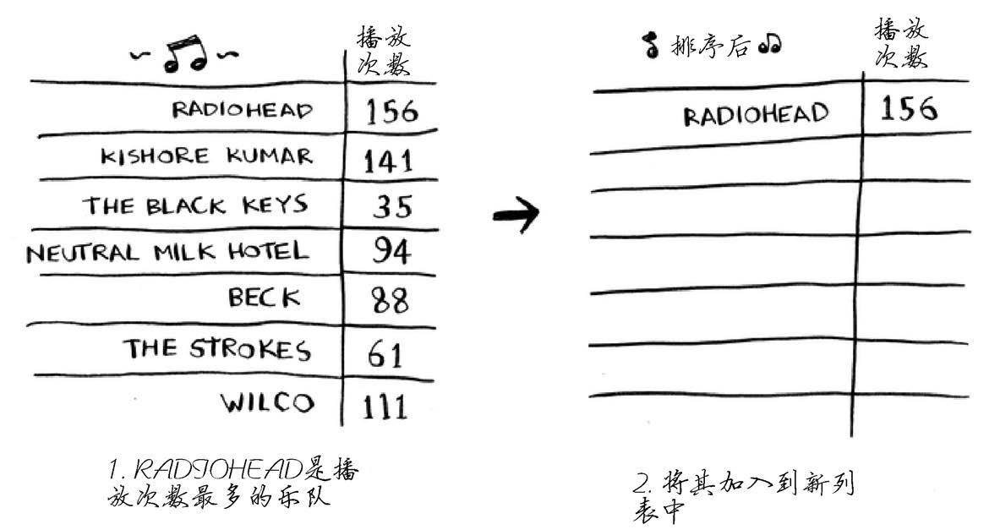
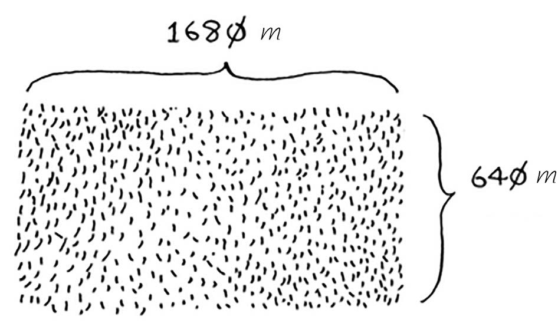
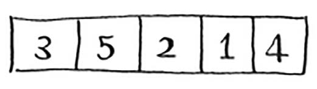
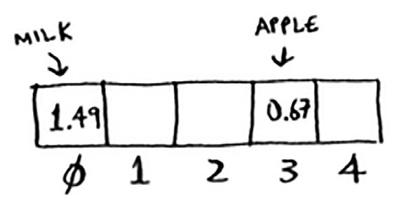
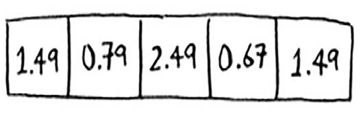

# 算法图解

## 第一章 算法简介

### 本章内容

> 1.编写第一种查找算法——二分查找。
> 2.学习如何谈论算法的运行时间——大O表示法。
> 3.了解一种常用的算法设计方法——递归。

算法是一组完成任务的指令。

### 1.1 二分查找

二分查找是一种算法，其输入是一个**有序的元素列表**（必须有序的原因稍后解释）。如果要查找的元素包含在列表中，二分查找返回其位置；否则返回null。

我随便想一个1～100的数字。


你的目标是以最少的次数猜到这个数字。你每次猜测后，我会说小了、大了或对了。

#### 1.1.1 简单查找

假设你从1开始依次往上猜，猜测过程会是这样。


这是简单查找，更准确的说法是傻找。每次猜测都只能排除一个数字。如果我想的数字是99，你得猜99次才能猜到！

#### 1.1.2 更佳的查找方式—二分查找

下面是一种更佳的猜法。从50 开始。


小了，但排除了一半的数字！至此，你知道1～50都小了。接下来，你猜75。


大了，那余下的数字又排除了一半！使用二分查找时，你猜测的是中间的数字，从而每次都将余下的数字排除一半。接下来，你猜63（50和75中间的数字）。


这就是二分查找，你学习了第一种算法！每次猜测排除的数字个数如下。


不管我心里想的是哪个数字，你在7次之内都能猜到，因为每次猜测都将排除很多数字！

假设你要在字典中查找一个单词，而该字典包含240000个单词，你认为每种查找最多需要多少步？
如果要查找的单词位于字典末尾，使用简单查找将需要240000步。使用二分查找时，每次排除一半单词，直到最后只剩下一个单词。


因此，使用二分查找只需18步——少多了！一般而言，对于包含n个元素的列表，用二分查找最多需要 $$log_2n$$ 步，而简单查找最多需要n步。

#### 1.1.3 代码表示

```python
# 二分查找
def binary_search(list, item):
	low = 0
	high = len(list) - 1  # low 和 high 用于跟踪要在其中查找地列表部分
    
	while low <= high:  # 只要范围没有缩小到只包含一个元素，就检查中间的元素
		mid = (low + high)
		guess = list[mid]  # 检查中间的元素
		if guess == item:  # 找到了元素
			return mid
		if guess > item:  # 猜的数字大了
			high = mid - 1
		else:  # 猜的数字小了
			low = mid + 1
	return None  # 没有指定的元素

# 测试代码
my_list = [1, 3, 5, 7, 9]

print(binary_search(my_list, 3))   # => 1 别忘了索引从0开始，第二个位置的索引为1
print(binary_search(my_list, -1))  # # => None 在Python中，None表示空，它意味着没有找到指定的元素

```

#### 1.1.4 运行时间

每次介绍算法时，我都将讨论其运行时间。一般而言，应选择效率最高的算法，以最大限度地减少运行时间或占用空间。
回到前面的二分查找。使用它可节省多少时间呢？简单查找逐个地检查数字，如果列表包含100个数字，最多需要猜100次。如果列表包含40亿个数字，最多需要猜40亿次。换言之，最多需要猜测的次数与列表长度相同，这被称为线性时间（linear time）。
二分查找则不同。如果列表包含100个元素，最多要猜7次；如果列表包含40亿个数字，最多需猜32次。厉害吧？二分查找的运行时间为对数时间（或 $$log_2$$ 时间）。下表总结了我们发现的情况。


### 1.2 大 O 表示法

大 O 表示法是一种特殊的表示法，指出了算法的速度有多快。例如，假设列表包含n个元素。简单查找需要检查每个元素，因此需要执行n次操作。使用大O表示法，这个运行时间为O(n)。单位秒呢？没有—大O表示法指的并非以秒为单位的速度。大O表示法让你能够比较操作数，它指出了算法运行时间的增速。

来看一个例子。为检查长度为n的列表，二分查找需要执行log n次操作。使用大O表示法，这个运行时间怎么表示呢？O(log n)。一般而言，大O表示法像下面这样。


这指出了算法需要**执行的操作数**。之所以称为大O表示法，是因为操作数前有个大O。这听起来像笑话，但事实如此！

> 注：O(log n) 中的 log n 指的是 $$log_2n$$

#### 1.2.1 大O 表示法指出了最糟情况下的运行时间

假设你使用简单查找在电话簿中找人。你知道，简单查找的运行时间为O(n)，这意味着在最糟情况下，必须查看电话簿中的每个条目。如果要查找的是Adit——电话簿中的第一个人，一次就能找到，无需查看每个条目。考虑到一次就找到了Adit，请问这种算法的运行时间是O(n)还是O(1)呢？
简单查找的运行时间总是为O(n)。查找Adit时，一次就找到了，这是最佳的情形，但大O表示法说的是最糟的情形。因此，你可以说，在最糟情况下，必须查看电话簿中的每个条目，对应的运行时间为O(n)。这是一个保证——你知道简单查找的运行时间不可能超过O(n)。

> 说明：
>
> 除最糟情况下的运行时间外，还应考虑平均情况的运行时间，这很重要。最糟情况和平均情况将在第4章讨论。

#### 1.2.2 一些常见的大O 运行时间

下面按从快到慢的顺序列出了你经常会遇到的5种大O运行时间。
O($$log n$$)，也叫对数时间，这样的算法包括二分查找。
O($$n$$)，也叫线性时间，这样的算法包括简单查找。
O($$n * log n$$)，这样的算法包括第4章将介绍的快速排序——一种速度较快的排序算法。
O($$n^2$$)，这样的算法包括第2章将介绍的选择排序——一种速度较慢的排序算法。
O($$n!$$)，这样的算法包括接下来将介绍的旅行商问题的解决方案——一种非常慢的算法。

> **说明：**
>
> 1.算法的速度指的并非时间，而是操作数的增速。
> 2.谈论算法的速度时，我们说的是随着输入的增加，其运行时间将以什么样的速度增加。
> 3.算法的运行时间用大O表示法表示。
> 4.O($$log n$$)比O($$n$$)快，当需要搜索的元素越多时，前者比后者快得越多。

#### 1.3.3 旅行商

阅读前一节时，你可能认为根本就没有运行时间为O(n!)的算法。让我来证明你错了！下面就是一个运行时间极长的算法。这个算法要解决的是计算机科学领域非常著名的旅行商问题，其计算时间增加得非常快，而有些非常聪明的人都认为没有改进空间。


有一位旅行商。
他需要前往5个城市。


这位旅行商（姑且称之为Opus吧）要前往这5个城市，同时要确保旅程最短。为此，可考虑前往这些城市的各种可能顺序。


对于每种顺序，他都计算总旅程，再挑选出旅程最短的路线。5个城市有120种不同的排列方式。因此，在涉及5个城市时，解决这个问题需要执行120次操作。涉及6个城市时，需要执行720次操作（有720种不同的排列方式）。涉及7个城市时，需要执行5040次操作！

推而广之，涉及n个城市时，需要执行n!（n的阶乘）次操作才能计算出结果。因此运行时间为O(n!)，即阶乘时间。除非涉及的城市数很少，否则需要执行非常多的操作。如果涉及的城市
数超过100，根本就不能在合理的时间内计算出结果—等你计算出结果，太阳都没了。

这种算法很糟糕！Opus应使用别的算法，可他别无选择。这是计算机科学领域待解的问题之一。对于这个问题，目前还没有找到更快的算法，有些很聪明的人认为这个问题根本就没有更巧妙的算法。面对这个问题，我们能做的只是去找出近似答案，更详细的信息请参阅第10章。

最后需要指出的一点是，高水平的读者可研究一下二叉树，这在最后一章做了简要的介绍。

## 第二章 选择排序

### 本章内容

> 1.学习两种最基本的数据结构——数组和链表，它们无处不在。第1章使用了数组，其他各章几乎也都将用到数组。数组是个重要的主题，一定要高度重视！但在有些情况下，使用链表比使用数组更合适。本章阐述数组和链表的优缺点，让你能够根据要实现的算法选择合适的一个。
> 2.学习第一种排序算法。很多算法仅在数据经过排序后才管用。还记得二分查找吗？它只能用于有序元素列表。本章将介绍选择排序。很多语言都内置了排序算法，因此你基本上不用从头开始编写自己的版本。但选择排序是下一章将介绍的快速排序的基石。快速排序是一种重要的算法，如果你熟悉其他排序算法，理解起来将更容易。

### 2.1 内存的工作原理

假设你去看演出，需要将东西寄存。寄存处有一个柜子，柜子有很多抽屉。


每个抽屉可放一样东西，你有两样东西要寄存，因此要了两个抽屉。


你将两样东西存放在这里。


现在你可以去看演出了！这大致就是计算机内存的工作原理。计算机就像是很多抽屉的集合体，每个抽屉都有地址。


fe0ffeeb是一个内存单元的地址。

需要将数据存储到内存时，你请求计算机提供存储空间，计算机给你一个存储地址。需要存储多项数据时，有两种基本方式——数组和链表。但它们并非都适用于所有的情形，因此知道它们的差别很重要。接下来介绍数组和链表以及它们的优缺点。

### 2.2 数组和链表

有时候，需要在内存中存储一系列元素。假设你要编写一个管理待办事项的应用程序，为此需要将这些待办事项存储在内存中。


应使用数组还是链表呢？鉴于数组更容易掌握，我们先将待办事项存储在数组中。使用数组意味着所有待办事项在内存中都是相连的（紧靠在一起的）。


现在假设你要添加第四个待办事项，但后面的那个抽屉放着别人的东西！


这就像你与朋友去看电影，找到地方就坐后又来了一位朋友，但原来坐的地方没有空位置，只得再找一个可坐下所有人的地方。在这种情况下，你需要请求计算机重新分配一块可容纳4个待办事项的内存，再将所有待办事项都移到那里。

如果又来了一位朋友，而当前坐的地方也没有空位，你们就得再次转移！真是太麻烦了。同样，在数组中添加新元素也可能很麻烦。如果没有了空间，就得移到内存的其他地方，因此添加新元素的速度会很慢。一种解决之是“预留座位”：即便当前只有3个待办事项，也请计算机提供10个位置，以防需要添加待办事项。这样，只要待办事项不超过10个，就无需转移。这是一个不错的权变措施，但你应该明白，它存在如下两个缺点。

​	1.你额外请求的位置可能根本用不上，这将浪费内存。你没有使用，别人也用不了。
​	2.待办事项超过10个后，你还得转移。

因此，这种权宜措施虽然不错，但绝非完美的解决方案。对于这种问题，可使用链表来解决。

#### 2.2.1 链表

链表中的元素可存储在内存的任何地方。


链表的每个元素都存储了下一个元素的地址，从而使一系列随机的内存地址串在一起。


这犹如寻宝游戏。你前往第一个地址，那里有一张纸条写着“下一个元素的地址为123”。因此，你前往地址123，那里又有一张纸条，写着“下一个元素的地址为847”，以此类推。在链表中添加元素很容易：只需将其放入内存，并将其地址存储到前一个元素中。

使用链表时，根本就不需要移动元素。这还可避免另一个问题。假设你与五位朋友去看一部很火的电影。你们六人想坐在一起，但看电影的人较多，没有六个在一起的座位。使用数组时有时就会遇到这样的情况。假设你要为数组分配10 000个位置，内存中有10 000个位置，但不都靠在一起。在这种情况下，你将无法为该数组分配内存！链表相当于说“我们分开来坐”，因此，只要有足够的内存空间，就能为链表分配内存。

链表的优势在插入元素方面，那数组的优势又是什么呢？

#### 2.2.2 数组

排行榜网站使用卑鄙的手段来增加页面浏览量。它们不在一个页面中显示整个排行榜，而将排行榜的每项内容都放在一个页面中，并让你单击Next来查看下一项内容。例如，显示十大电视反派时，不在一个页面中显示整个排行榜，而是先显示第十大反派（Newman）。你必须在每个页面中单击Next，才能看到第一大反派（Gustavo Fring）。这让网站能够在10个页面中显示广告，但用户需要单击Next 九次才能看到第一个，真的是很烦。如果整个排行榜都显示在一个页面中，将方便得多。这样，用户可单击排行榜中的人名来获得更详细的信息。


链表存在类似的问题。在需要读取链表的最后一个元素时，你不能直接读取，因为你不知道它所处的地址，必须先访问元素#1，从中获取元素#2的地址，再访问元素#2并从中获取元素#3
的地址，以此类推，直到访问最后一个元素。需要同时读取所有元素时，链表的效率很高：你读取第一个元素，根据其中的地址再读取第二个元素，以此类推。但如果你需要跳跃，链表的效率真的很低。

数组与此不同：你知道其中每个元素的地址。例如，假设有一个数组，它包含五个元素，起始地址为00，那么元素#5的地址是多少呢？

只需执行简单的数学运算就知道：04。需要随机地读取元素时，数组的效率很高，因为可迅速找到数组的任何元素。在链表中，元素并非靠在一起的，你无法迅速计算出第五个元素的内存地址，而必须先访问第一个元素以获取第二个元素的地址，再访问第二个元素以获取第三个元素的地址，以此类推，直到访问第五个元素。

#### 2.2.3 术语

数组的元素带编号，编号从0而不是1开始。例如，在下面的数组中，元素20的位置为1。


而元素10的位置为0。这通常会让新手晕头转向。从0开始让基于数组的代码编写起来更容易，因此程序员始终坚持这样做。几乎所有的编程语言都从0开始对数组元素进行编号。你很快就会习惯这种做法。

元素的位置称为**索引**。因此，不说“元素20的位置为1”，而说“**元素20位于索引1处**”。本书将使用索引来表示位置。

下面列出了常见的数组和链表操作的运行时间。


#### 2.2.4 在中间插入

假设你要让待办事项按日期排列。之前，你在清单末尾添加了待办事项。
但现在你要根据新增待办事项的日期将其插入到正确的位置。


需要在中间插入元素时，数组和链表哪个更好呢？使用链表时，插入元素很简单，只需修改它前面的那个元素指向的地址。


而使用数组时，则必须将后面的元素都向后移。


如果没有足够的空间，可能还得将整个数组复制到其他地方！因此，当需要在中间插入元素时，链表是更好的选择。

#### 2.2.5 删除

如果你要删除元素呢？链表也是更好的选择，因为只需修改前一个元素指向的地址即可。而使用数组时，删除元素后，必须将后面的元素都向前移。

不同于插入，删除元素总能成功。如果内存中没有足够的空间，插入操作可能失败，但在任何情况下都能够将元素删除。

下面是常见数组和链表操作的运行时间。


需要指出的是，仅当能够立即访问要删除的元素时，删除操作的运行时间才为O(1)。通常我们都记录了链表的第一个元素和最后一个元素，因此删除这些元素时运行时间为O(1)。

数组和链表哪个用得更多呢？显然要看情况。但数组用得很多，因为它支持随机访问。有两种访问方式：随机访问和顺序访问。顺序访问意味着从第一个元素开始逐个地读取元素。链表只能顺序访问：要读取链表的第十个元素，得先读取前九个元素，并沿链接找到第十个元素。随机访问意味着可直接跳到第十个元素。本书经常说数组的读取速度更快，这是因为它们支持随机访问。很多情况都要求能够随机访问，因此数组用得很多。

### 2.3 选择排序

假设你的计算机存储了很多乐曲。对于每个乐队，你都记录了其作品被播放的次数。


你要将这个列表按播放次数从多到少的顺序排列，从而将你喜欢的乐队排序。该如何做呢？

一种办法是遍历这个列表，找出作品播放次数最多的乐队，并将该乐队添加到一个新列表中。



再次这样做，找出播放次数第二多的乐队。


继续这样做，你将得到一个有序列表。


下面从计算机科学的角度出发，看看这需要多长时间。别忘了，O(n)时间意味着查看列表中的每个元素一次。例如，对乐队列表进行简单查找时，意味着每个乐队都要查看一次。


要找出播放次数最多的乐队，必须检查列表中的每个元素。正如你刚才看到的，这需要的时间为O(n)。因此对于这种时间为O(n)的操作，你需要执行n次。


需要的总时间为 O(n × n)，即O(n2)。
排序算法很有用。你现在可以对如下内容进行排序：

- 电话簿中的人名-
- 旅行日期
- 电子邮件（从新到旧）

> **需要检查的元素数越来越少**
>
> 随着排序的进行，每次需要检查的元素数在逐渐减少，最后一次需要检查的元素都只有一个。既然如此，运行时间怎么还是$$O(n^2)$$呢？这个问题问得好，这与大$$O$$表示法中的常数相关。第4章将详细解释，这里只简单地说一说。
>
> 你说得没错，并非每次都需要检查n个元素。第一次需要检查n个元素，但随后检查的元素数依次为$$ n × 1, n – 2, …, 2$$和$$1$$。平均每次检查的元素数为$$1/2 × n$$，因此运行时间为$$O(n × 1/2 × n)$$。但大$$O$$表示法省略诸如1/2这样的常数（有关这方面的完整讨论，请参阅第4章），因此简单地写作$$O(n × n)$$或$$O(n^2)$$。

 选择排序是一种灵巧的算法，但其速度不是很快。快速排序是一种更快的排序算法，其运行时间为$$O(n log n)$$，这将在下一章介绍。

#### 2.3.1 代码表示

```python
# 将数组元素按从小到大的顺序排列。
def findSmallest(arr):
	smallest = arr[0]  # 存储最小值
	smallest_index = 0  # 存储最小元素的索引
	for i in range(1, len(arr)):
		if arr[i] < smallest:
			smallest = arr[i]
			smallest_index = i
	return smallest_index

# 排序算法
def selectionSort(arr):  # 对数组进行排序
	newArr = []
	for i in range(len(arr)):
		smallest = findSmallest(arr)
		newArr.append(arr.pop(smallest))  # 找出数组中最小的元素，并将其加入到新数组中
	return newArr

# 测试
print(selectionSort([5, 3, 6, 2, 10]))
```

### 2.4 小结

- 计算机内存犹如一大堆抽屉。

- 需要存储多个元素时，可使用数组或链表。

- 数组的元素都在一起。

- 链表的元素是分开的，其中每个元素都存储了下一个元素的地址。

- 数组的读取速度很快。

- 链表的插入和删除速度很快。

- 在同一个数组中，所有元素的类型都必须相同（都为int、double等）。

## 第三章 递归

### 本章内容

> - 学习递归。递归是很多算法都使用的一种编程方法，是理解本书后续内容的关键。
>
> - 学习如何将问题分成基线条件和递归条件。第4章将介绍的分而治之策略使用这种简单的
>   概念来解决棘手的问题。

### 3.1 递归

假设你在祖母的阁楼中翻箱倒柜，发现了一个上锁的神秘手提箱。


祖母告诉你，钥匙很可能在下面这个盒子里。


这个盒子里有盒子，而盒子里的盒子又有盒子。钥匙就在某个盒子中。为找到钥匙，你将使用什么算法？先想想这个问题，再接着往下看。

下面是一种方法。


(1) 创建一个要查找的盒子堆。

(2) 从盒子堆取出一个盒子，在里面找。
(3) 如果找到的是盒子，就将其加入盒子堆中，以便以后再查找。
(4) 如果找到钥匙，则大功告成！
(5) 回到第二步。

下面是另一种方法。


(1) 检查盒子中的每样东西。
(2) 如果是盒子，就回到第一步。
(3) 如果是钥匙，就大功告成！

在你看来，哪种方法更容易呢？第一种方法使用的是 while 循环：只要盒子堆不空，就从中取一个盒子，并在其中仔细查找。

```python
def look_for_key(main_box):
	pile = main_box.make_a_pile_to_look_through()
	while pile is not empty:
		box = pile.grab_a_box()
		for item in box:
			if item.is_a_box():
				pile.append(item)
			elif item.is_a_key():
				print("found the key!")
```

第二种方法使用递归——函数调用自己，这种方法的伪代码如下。

```python
def look_for_key(box):
	for item in box:
		if item.is_a_box():
			look_for_key(item)
		elif item.is_a_key():
			print("found the key!")
```

这两种方法的作用相同，但在我看来，第二种方法更清晰。递归只是让解决方案更清晰，并没有性能上的优势。实际上，在有些情况下，使用循环的性能更好。我很喜欢Leigh Caldwell在Stack Overflow上说的一句话：“如果使用循环，程序的性能可能更高；如果使用递归，程序可能更容易理解。如何选择要看什么对你来说更重要。“

很多算法都使用了递归，因此理解这种概念很重要。

### 3.2 基线条件和递归条件

由于递归函数调用自己，因此编写这样的函数时很容易出错，进而导致无限循环。例如，假设你要编写一个像下面这样倒计时的函数。

3...2...1

为此，你可以用递归的方式编写，如下所示。

```python
def countdown(i):
print i
countdown(i-1)
```

如果你运行上述代码，将发现一个问题：这个函数运行起来没完没了！


3...2...1...0...-1...-2...

（要让脚本停止运行，可按 Ctrl + C。）

编写递归函数时，必须告诉它何时停止递归。正因为如此，每个递归函数都有两部分：基线条件（base case）和递归条件（recursive case）。递归条件指的是函数调用自己，而基线条件则指的是函数不再调用自己，从而避免形成无限循环。

我们来给函数countdown添加基线条件。

```python
def countdown(i):
	print i
	if i <= 0:  # 基线条件
		return
	else:  # 递归条件
		countdown(i-1)
```

现在，这个函数将像预期的那样运行，如下所示。


### 3.3 栈

假设你去野外烧烤，并为此创建了一个待办事项清单——一叠
便条。


本书之前讨论数组和链表时，也有一个待办事项清单。你可将待办事项添加到该清单的任何地方，还可删除任何一个待办事项。一叠便条要简单得多：插入的待办事项放在清单的最前面；读取待办事项时，你只读取最上面的那个，并将其删除。因此这个待办事项清单只有两种操作：压入（插入）和弹出（删除并读取）。


下面来看看如何使用这个待办事项清单。


这种数据结构称为栈。栈是一种简单的数据结构，刚才我们一直在使用它，却没有意识到！

#### 3.3.1 调用栈

计算机在内部使用被称为调用栈的栈。我们来看看计算机是如何使用调用栈的。下面是一个简单的函数。

```python
def greet(name):
	print("hello, " + name + "!")
	greet2(name)
	print("getting ready to say bye...")
	bye()
```

这个函数问候用户，再调用另外两个函数。这两个函数的代码如下。

```python
def greet2(name):
print "how are you, " + name + "?"
def bye():
print "ok bye!"
```

下面详细介绍调用函数时发生的情况。

> **说明：**
>
> 在Python中，print是一个函数，但出于简化考虑，这里假设它不是函数。你也这样假设就行了。

假设你调用greet("maggie")，计算机将首先为该函数调用分配一块内存。


我们来使用这些内存。变量name被设置为maggie，这需要存储到内存中。


每当你调用函数时，计算机都像这样将函数调用涉及的所有变量的值存储到内存中。接下来，你打印hello, maggie!，再调用greet2("maggie")。同样，计算机也为这个函数调用分配一
块内存。


计算机使用一个栈来表示这些内存块，其中第二个内存块位于第一个内存块上面。你打印how are you, maggie?，然后从函数调用返回。此时，栈顶的内存块被弹出。


现在，栈顶的内存块是函数greet的，这意味着你返回到了函数greet。当你调用函数greet2时，函数greet只执行了一部分。这是本节的一个重要概念：调用另一个函数时，当前函数暂停并处于未完成状态。该函数的所有变量的值都还在内存中。执行完函数greet2后，你回到函数greet，并从离开的地方开始接着往下执行：首先打印getting ready to say bye…，再调用函数bye。


在栈顶添加了函数bye的内存块。然后，你打印ok bye!，并从这个函数返回。


现在你又回到了函数greet。由于没有别的事情要做，你就从函数greet返回。这个栈用于存储多个函数的变量，被称为调用栈。

#### 3.3.2 递归调用栈

递归函数也使用调用栈！来看看递归函数factorial的调用栈。factorial(5)写作5!，其定义如下：5! = 5 * 4 * 3 * 2 * 1。同理，factorial(3)为3 * 2 * 1。下面是计算阶乘的递归函数。

```python
def fact(x):
	if x == 1:
		return 1
	else:
		return x * fact(x-1)
```

下面来详细分析调用fact(3)时调用栈是如何变化的。别忘了，栈顶的方框指出了当前执行到了什么地方。


注意，每个fact调用都有自己的x变量。在一个函数调用中不能访问另一个的x变量。

栈在递归中扮演着重要角色。在本章开头的示例中，有两种寻找钥匙的方法。下面再次列出了第一种方法。


使用这种方法时，你创建一个待查找的盒子堆，因此你始终知道还有哪些盒子需要查找。


但使用递归方法时，没有盒子堆。


既然没有盒子堆，那算法怎么知道还有哪些盒子需要查找呢？下面是一个例子。


此时，调用栈类似于下面这样。


原来“盒子堆”存储在了栈中！这个栈包含未完成的函数调用，每个函数调用都包含还未检查完的盒子。使用栈很方便，因为你无需自己跟踪盒子堆——栈替你这样做了。

使用栈虽然很方便，但是也要付出代价：存储详尽的信息可能占用大量的内存。每个函数调用都要占用一定的内存，如果栈很高，就意味着计算机存储了大量函数调用的信息。在这种情况下，你有两种选择。

- 重新编写代码，转而使用循环。
- 使用**尾递归**。这是一个高级递归主题，不在本书的讨论范围内。另外，并非所有的语言都支持尾递归。

### 3.4 小结

- 递归指的是调用自己的函数。
- 每个递归函数都有两个条件：基线条件和递归条件。
- 栈有两种操作：压入和弹出。
- 所有函数调用都进入调用栈。
- 调用栈可能很长，这将占用大量的内存。

## 第四章 快速排序

### 本章内容

> - 学习分而治之。有时候，你可能会遇到使用任何已知的算法都无法解决的问题。优秀的算法学家遇到这种问题时，不会就此放弃，而是尝试使用掌握的各种问题解决方法来找出解决方案。分而治之是你学习的第一种通用的问题解决方法。
>
> - 学习快速排序——一种常用的优雅的排序算法。快速排序使用分而治之的策略。

我们将探索分而治之（divide and conquer，D&C）——一种著名的递归式问题解决方法。

只能解决一种问题的算法毕竟用处有限，而D&C提供了解决问题的思路，是另一个可供你使用的工具。面对新问题时，你不再束手无策，而是自问：“使用分而治之能解决吗？”

### 4.1 分而治之

假设你是农场主，有一小块土地。



你要将这块地均匀地分成方块，且分出的方块要尽可能大。显然，下面的分法都不符合要求。


如何将一块地均匀地分成方块，并确保分出的方块是最大的呢？使用D&C策略！D&C算法是递归的。使用D&C解决问题的过程包括两个步骤。

(1) 找出基线条件，这种条件必须尽可能简单。
(2) 不断将问题分解（或者说缩小规模），直到符合基线条件。

下面就来使用D&C找出前述问题的解决方案。可你能使用的最大方块有多大呢？

首先，找出基线条件。最容易处理的情况是，一条边的长度是另一条边的整数倍。


如果一边长25 m，另一边长50 m，那么可使用的最大方块为 25 m×25 m。换言之，可以将这块地分成两个这样的方块。

现在需要找出递归条件，这正是D&C的用武之地。根据D&C的定义，每次递归调用都必须缩小问题的规模。如何缩小前述问题的规模呢？我们首先找出这块地可容纳的最大方块。


你可以从这块地中划出两个640 m×640 m的方块，同时余下一小块地。现在是顿悟时刻：何不对余下的那一小块地使用相同的算法呢？


最初要划分的土地尺寸为1680 m×640 m，而现在要划分的土地更小，为640 m×400 m。**适用于这小块地的最大方块，也是适用于整块地的最大方块。**换言之，你将均匀划分1680 m×640 m土地的问题，简化成了均匀划分640 m×400 m土地的问题！

> **欧几里得算法**
>
> 前面说“适用于这小块地的最大方块，也是适用于整块地的最大方块”，如果你觉得这一点不好理解，也不用担心。这确实不好理解，但遗憾的是，要证明这一点，需要的篇幅有点长，在本书中无法这样做，因此你只能选择相信这种说法是正确的。如果你想搞明白其中的原因，可参阅欧几里得算法。可汗学院很清楚地阐述了这种算法，网址为https://www.khanacademy.org/computing/computer-science/ryptography/modarithmetic/a/the-euclidean-algorithm。

下面再次使用同样的算法。对于640 m × 400 m的土地，可从中划出的最大方块为400 m × 400 m。


这将余下一块更小的土地，其尺寸为400 m × 240 m。


你可从这块土地中划出最大的方块，余下一块更小的土地，其尺寸为240 m × 160 m。


接下来，从这块土地中划出最大的方块，余下一块更小的土地。


余下的这块土地满足基线条件，因为160是80的整数倍。将这块土地分成两个方块后，将不会余下任何土地！


因此，对于最初的那片土地，适用的最大方块为80 m× 80 m。


这里重申一下D&C的工作原理：

(1) 找出简单的基线条件；

(2) 确定如何缩小问题的规模，使其符合基线条件。

D&C并非可用于解决问题的算法，而是一种解决问题的思路。

**我们再来看一个例子。**

给定一个数字数组。


你需要将这些数字相加，并返回结果。使用循环很容易完成这种任务。

第一步：找出基线条件。最简单的数组什么样呢？请想想这个问题，再接着往下读。如果数组不包含任何元素或只包含一个元素，计算总和将非常容易。


因此这就是基线条件。

第二步：每次递归调用都必须离空数组更近一步。如何缩小问题的规模呢？下面是一种办法。


这与下面的版本等效。


这两个版本的结果都为12，但在第二个版本中，给函数sum传递的数组更短。换言之，这缩小了问题的规模！

函数sum的工作原理类似于下面这样。


这个函数的运行过程如下。


别忘了，递归记录了状态。


> **提示**
>
> 编写涉及数组的递归函数时，基线条件通常是数组为空或只包含一个元素。陷入困境时，请检查基线条件是不是这样的。

> **函数式编程一瞥**
>
> 你可能想，既然使用循环可轻松地完成任务，为何还要使用递归方式呢？看看函数式编程你就明白了！诸如Haskell等函数式编程语言没有循环，因此你只能使用递归来编写这样的函数。如果你对递归有深入的认识，函数式编程语言学习起来将更容易。例如，使用Haskell时，你可能这样编写函数sum。
>
> sum [] = 0  # 基线条件
> sum (x:xs) = x + (sum xs)  # 递归条件
> 注意，这就像是你有函数的两个定义。符合基线条件时运行第一个定义，符合递归条件时运行第二个定义。也可以使用Haskell语言中的if语句来编写这个函数。
>
> sum arr = if arr == []
> 		    then 0
> 		    else (head arr) + (sum (tail arr))
> 但前一个版本更容易理解。Haskell大量使用了递归，因此它提供了各种方便实现递归的语法。如果你喜欢递归或想学习一门新语言，可以研究一下Haskell。

### 4.2 快速排序

快速排序是一种常用的排序算法，比选择排序快得多。例如，C语言标准库中的函数qsort实现的就是快速排序。快速排序也使用了D&C。

下面来使用快速排序对数组进行排序。对排序算法来说，最简单的数组什么样呢？还记得前一节的“提示”吗？就是根本不需要排序的数组。


因此，基线条件为数组为空或只包含一个元素。在这种情况下，只需原样返回数组——根本就不用排序。

```python
def quicksort(array):
	if len(array) < 2:
		return array
```

我们来看看更长的数组。对包含两个元素的数组进行排序也很容易。


包含三个元素的数组呢？


别忘了，你要使用D&C，因此需要将数组分解，直到满足基线条件。下面介绍快速排序的工作原理。首先，从数组中选择一个元素，这个元素被称为基准值（pivot）。

稍后再介绍如何选择合适的基准值。我们暂时将数组的第一个元素用作基准值。


接下来，找出比基准值小的元素以及比基准值大的元素。


这被称为分区（partitioning）。现在你有：

1) 一个由所有小于基准值的数字组成的子数组；

2) 基准值；

3) 一个由所有大于基准值的数组组成的子数组。

这里只是进行了分区，得到的两个子数组是无序的。但如果这两个数组是有序的，对整个数组进行排序将非常容易。


如果子数组是有序的，就可以像下面这样合并得到一个有序的数组：左边的数组 + 基准值 + 右边的数组。在这里，就是[10, 15] + [33] + []，结果为有序数组[10, 15, 33]。

如何对子数组进行排序呢？对于包含两个元素的数组（左边的子数组）以及空数组（右边的子数组），快速排序知道如何将它们排序，因此只要对这两个子数组进行快速排序，再合并结果，
就能得到一个有序数组！

```python
quicksort([15, 10]) + [33] + quicksort([])
> [10, 15, 33]  # 一个有序数组
```

不管将哪个元素用作基准值，这都管用。假设你将15用作基准值。


这个子数组都只有一个元素，而你知道如何对这些数组进行排序。现在你就知道如何对包含三个元素的数组进行排序了，步骤如下。

(1) 选择基准值。

(2) 将数组分成两个子数组：小于基准值的元素和大于基准值的元素。

(3) 对这两个子数组进行快速排序。

包含四个元素的数组呢？


假设你也将33用作基准值。


左边的子数组包含三个元素，而你知道如何对包含三个元素的数组进行排序：对其递归地调用快速排序。


因此你能够对包含四个元素的数组进行排序。如果能够对包含四个元素的数组进行排序，就能对包含五个元素的数组进行排序。为什么呢？假设有下面这样一个包含五个元素的数组。



根据选择的基准值，对这个数组进行分区的各种可能方式如下。


注意，这些子数组包含的元素数都在0～4内，而你已经知道如何使用快速排序对包含0～4个元素的数组进行排序！因此，不管如何选择基准值，你都可对划分得到的两个子数组递归地进行快速排序。

例如，假设你将3用作基准值，可对得到的子数组进行快速排序。


将子数组排序后，将它们合并，得到一个有序数组。即便你将5用作基准值，这也可行。


将任何元素用作基准值都可行，因此你能够对包含五个元素的数组进行排序。同理，你能够对包含六个元素的数组进行排序，以此类推。

>**归纳证明**
>
>刚才你大致见识了归纳证明！归纳证明是一种证明算法行之有效的方式，它分两步：基线条件和归纳条件。是不是有点似曾相识的感觉？例如，假设我要证明我能爬到梯子的最上面。递归条件是这样的：如果我站在一个横档上，就能将脚放到下一个横档上。换言之，如果我站在第二个横档上，就能爬到第三个横档。这就是归纳条件。而基线条件是这样的，即我已经站在第一个横档上。因此，通过每次爬一个横档，我就能爬到梯子最顶端。
>
>对于快速排序，可使用类似的推理。在基线条件中，我证明这种算法对空数组或包含一个元素的数组管用。在归纳条件中，我证明如果快速排序对包含一个元素的数组管用，对包含两个元素的数组也将管用；如果它对包含两个元素的数组管用，对包含三个元素的数组也将管用，以此类推。因此，我可以说，快速排序对任何长度的数组都管用。这里不再深入讨论归纳证明，但它很有趣，并与D&C协同发挥作用。


#### 4.2.1 代码表示

```python
def quicksort(array):
	if len(array) < 2:
		return array  # 基线条件：为空或只包含一个元素的数组是“有序”的
	else:
		pivot = array[0]  # 递归条件
		less = [i for i in array[1:] if i <= pivot]  # 有所有小于基准值的元素组成的子数组
		greater = [i for i in array[1:] if i > pivot]  # 由所有大于基准值的元素组成的子数组
		return quicksort(less) + [pivot] + quicksort(greater)

print(quicksort([10, 5, 2, 3]))
```

### 4.3 再谈大$O$表示法

快速排序的独特之处在于，其速度取决于选择的基准值。在讨论快速排序的运行时间前，我们再来看看最常见的大O运行时间。


上述图表中的时间是基于每秒执行10次操作计算得到的。这些数据并不准确，这里提供它们只是想让你对这些运行时间的差别有大致认识。实际上，计算机每秒执行的操作远不止10次。

对于每种运行时间，本书还列出了相关的算法。来看看第2章介绍的选择排序，其运行时间为$$O(n^2)$$，速度非常慢。

还有一种名为合并排序（merge sort）的排序算法，其运行时间为$$O(n log n)$$，比选择排序快得多！快速排序的情况比较棘手，在最糟情况下，其运行时间为$$O(n^2)$$。

与选择排序一样慢！但这是最糟情况。在平均情况下，快速排序的运行时间为$$O(n log n)$$。你可能会有如下疑问。

- 这里说的最糟情况和平均情况是什么意思呢？

- 若快速排序在平均情况下的运行时间为$$O(n log n)$$，而合并排序的运行时间总是$$O(n log n​$$)，为何不使用合并排序？它不是更快吗？

#### 4.3.1 比较合并排序和快速排序

假设有下面这样打印列表中每个元素的简单函数。

```python
def print_items(list):
	for item in list:
		print item
```

这个函数遍历列表中的每个元素并将其打印出来。它迭代整个列表一次，因此运行时间为O(n)。现在假设你对这个函数进行修改，使其在打印每个元素前都休眠1秒钟。

```python
from time import sleep
def print_items2(list):
	for item in list:
		sleep(1)
		print item
```

它在打印每个元素前都暂停1秒钟。假设你使用这两个函数来打印一个包含5个元素的列表。


这两个函数都迭代整个列表一次，因此它们的运行时间都为O(n)。你认为哪个函数的速度更快呢？我认为print_items要快得多，因为它没有在每次打印元素前都暂停1秒钟。因此，虽然使用大O表示法表示时，这两个函数的速度相同，但实际上print_items的速度更快。在大O表示法O(n)中，n实际上指的是这样的。


c是算法所需的固定时间量，被称为常量。例如，print_ items所需的时间可能是10毫秒 * n，而print_items2所需的时间为1秒 * n。

通常不考虑这个常量，因为如果两种算法的大O运行时间不同，这种常量将无关紧要。就拿二分查找和简单查找来举例说明。假设这两种算法的运行时间包含如下常量。


你可能认为，简单查找的常量为10毫秒，而二分查找的常量为1秒，因此简单查找的速度要快得多。现在假设你要在包含40亿个元素的列表中查找，所需时间将如下。


正如你看到的，二分查找的速度还是快得多，常量根本没有什么影响。

但有时候，常量的影响可能很大，对快速查找和合并查找来说就是如此。快速查找的常量比合并查找小，因此如果它们的运行时间都为O(n log n)，快速查找的速度将更快。实际上，快速查找的速度确实更快，因为相对于遇上最糟情况，它遇上平均情况的可能性要大得多。

此时你可能会问，何为平均情况，何为最糟情况呢？

#### 4.3.2 平均情况和最糟情况

快速排序的性能高度依赖于你选择的基准值。假设你总是将第一个元素用作基准值，且要处理的数组是有序的。由于快速排序算法不检查输入数组是否有序，因此它依然尝试对其进行排序。


注意，数组并没有被分成两半，相反，其中一个子数组始终为空，这导致调用栈非常长。现在假设你总是将中间的元素用作基准值，在这种情况下，调用栈如下。


调用栈短得多！因为你每次都将数组分成两半，所以不需要那么多递归调用。你很快就到达了基线条件，因此调用栈短得多。

第一个示例展示的是最糟情况，而第二个示例展示的是最佳情况。在最糟情况下，栈长为O(n)，而在最佳情况下，栈长为O(log n)。

现在来看看栈的第一层。你将一个元素用作基准值，并将其他的元素划分到两个子数组中。这涉及数组中的全部8个元素，因此该操作的时间为O(n)。在调用栈的第一层，涉及全部8个元素，
但实际上，在调用栈的每层都涉及O(n)个元素。


即便以不同的方式划分数组，每次也将涉及O(n)个元素。


因此，完成每层所需的时间都为O(n)。


在这个示例中，层数为$$O(log n)$$（用技术术语说，调用栈的高度为$$O(log n)$$，而每层需要的时间为O(n)。因此整个算法需要的时间为$$O(n) * O(log n) = O(n log n)$$。这就是最佳情况。

在最糟情况下，有O(n)层，因此该算法的运行时间为$$O(n) * O(n) = O(n^2)$$。

知道吗？这里要告诉你的是，最佳情况也是平均情况。只要你每次都随机地选择一个数组元素作为基准值，快速排序的平均运行时间就将为$$O(n log n)$$。快速排序是最快的排序算法之一，也是D&C典范。

### 4.4 小结

- D&C将问题逐步分解。使用D&C处理列表时，基线条件很可能是空数组或只包含一个元素的数组。
- 实现快速排序时，请随机地选择用作基准值的元素。快速排序的平均运行时间为O(n log n)。
- 大O表示法中的常量有时候事关重大，这就是快速排序比合并排序快的原因所在。
- 比较简单查找和二分查找时，常量几乎无关紧要，因为列表很长时，O(log n)的速度比O(n)快得多。

## 第五章 散列表

### 本章内容

> - 学习散列表——最有用的基本数据结构之一。散列表用途广泛，本章将介绍其常见的用途。
> - 学习散列表的内部机制：实现、冲突和散列函数。这将帮助你理解如何分析散列表的性能。

假设你在一家杂货店上班。有顾客来买东西时，你得在一个本子中查找价格。如果本子的内容不是按字母顺序排列的，你可能为查找苹果（apple）的价格而浏览每一行，这需要很长的时间。此时你使用的是第1章介绍的简单查找，需要浏览每一行。还记得这需要多长时间吗？O(n)。如果本子的内容是按字母顺序排列的，可使用二分查找来找出苹果的价格，这需要的时间更短，为O(log n)。


需要提醒你的是，运行时间O(n)和O(log n)之间有天壤之别！假设你每秒能够看10行，使用简单查找和二分查找所需的时间将如下。


你知道，二分查找的速度非常快。但作为收银员，在本子中查找价格是件很痛苦的事情，哪怕本子的内容是有序的。在查找价格时，你都能感觉到顾客的怒气。看来真的需要一名能够记住所有商品价格的雇员，这样你就不用查找了：问她就能马上知道答案。


不管商品有多少，这位雇员（假设她的名字为Maggie）报出任何商品的价格的时间都为O(1)，速度比二分查找都快。


真是太厉害了！如何聘到这样的雇员呢？

下面从数据结构的角度来看看。前面介绍了两种数据结构：数组和链表（其实还有栈，但栈并不能用于查找）。你可使用数组来实现记录商品价格的本子。


这种数组的每个元素包含两项内容：商品名和价格。如果将这个数组按商品名排序，就可使用二分查找在其中查找商品的价格。这样查找价格的时间将为O(log n)。然而，你希望查找商品价格的时间为O(1)，即你希望查找速度像Maggie那么快，这是散列函数的用武之地。

### 5.1 散列函数

散列函数是这样的函数，即无论你给它什么数据，它都还你一个数字。


如果用专业术语来表达的话，我们会说，散列函数“将输入映射到数字”。你可能认为散列函数输出的数字没什么规律，但其实散列函数必须满足一些要求。

- 它必须是一致的。例如，假设你输入apple时得到的是4，那么每次输入apple时，得到的都必须为4。如果不是这样，散列表将毫无用处。
- 它应将不同的输入映射到不同的数字。例如，如果一个散列函数不管输入是什么都返回1，它就不是好的散列函数。最理想的情况是，将不同的输入映射到不同的数字。

散列函数将输入映射为数字，这有何用途呢？你可使用它来打造你的“Maggie”！

为此，首先创建一个空数组。


你将在这个数组中存储商品的价格。下面来将苹果的价格加入到这个数组中。为此，将apple作为输入交给散列函数。


散列函数的输出为3，因此我们将苹果的价格存储到数组的索引3处。


下面将牛奶（milk）的价格存储到数组中。为此，将milk作为散列函数的输入。


散列函数的输出为0，因此我们将牛奶的价格存储在索引0处。



不断地重复这个过程，最终整个数组将填满价格。



现在假设需要知道鳄梨（avocado）的价格。你无需在数组中查找，只需将avocado作为输入交给散列函数。


它将告诉你鳄梨的价格存储在索引4处。果然，你在那里找到了。


散列函数准确地指出了价格的存储位置，你根本不用查找！之所以能够这样，具体原因如下。

- 散列函数总是将同样的输入映射到相同的索引。每次你输入avocado，得到的都是同一个
  数字。因此，你可首先使用它来确定将鳄梨的价格存储在什么地方，并在以后使用它来
  确定鳄梨的价格存储在什么地方。
- 散列函数将不同的输入映射到不同的索引。avocado映射到索引4，milk映射到索引0。每
  种商品都映射到数组的不同位置，让你能够将其价格存储到这里。
- 散列函数知道数组有多大，只返回有效的索引。如果数组包含5个元素，散列函数就不会
  返回无效索引100。

刚才你就打造了一个“Maggie”！你结合使用散列函数和数组创建了一种被称为散列表（hash table）的数据结构。散列表是你学习的第一种包含额外逻辑的数据结构。数组和链表都被直接映射到内存，但散列表更复杂，它使用散列函数来确定元素的存储位置。

在你将学习的复杂数据结构中，散列表可能是最有用的，也被称为散列映射、映射、字典和关联数组。散列表的速度很快！还记得第2章关于数组和链表的讨论吗？你可以立即获取数组中的元素，而散列表也使用数组来存储数据，因此其获取元素的速度与数组一样快。

你可能根本不需要自己去实现散列表，任一优秀的语言都提供了散列表实现。Python提供的散列表实现为字典，你可使用函数dict来创建散列表。

`book = dict()`


创建散列表book后，在其中添加一些商品的价格。

```python
book["apple"] = 0.67  # 一个苹果的价格为67美分
book["milk"] = 1.49  # 牛奶的价格为1.49美分
book["avocado"] = 1.49
print book
# {'avocado': 1.49, 'apple': 0.67, 'milk': 1.49}
```

非常简单！我们来查询鳄梨的价格。

`print book["avocado"]`

散列表由键和值组成。在前面的散列表book中，键为商品名，值为商品价格。散列表将键映射到值。
在下一节中，你将看到一些散列表使用示例。

### 5.2 应用案例

散列表用途广泛，本节将介绍几个应用案例。

#### 5.2.1 将散列表用于查找

手机都内置了方便的电话簿，其中每个姓名都有对应的电话号码。


假设你要创建一个类似这样的电话簿，将姓名映射到电话号码。该电话簿需要提供如下功能。

- 添加联系人及其电话号码。
- 通过输入联系人来获悉其电话号码。

这非常适合使用散列表来实现！在下述情况下，使用

散列表是很不错的选择。
- 创建映射。
- 查找。

创建电话簿非常容易。首先，新建一个散列表。

`phone_book = dict()`

顺便说一句，Python提供了一种创建散列表的快捷方式——使用一对大括号。

```python
phone_book = {}  # 与phone_book = dict()等效
```

下面在这个电话簿中添加一些联系人的电话号码。

```python
phone_book["jenny"] = 8675309
phone_book["emergency"] = 911
```

这就成了！现在，假设你要查找Jenny的电话号码，为此只需向散列表传入相应的键。

